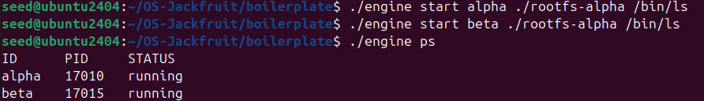
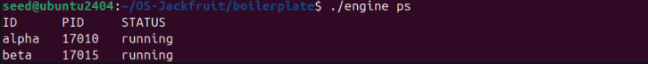
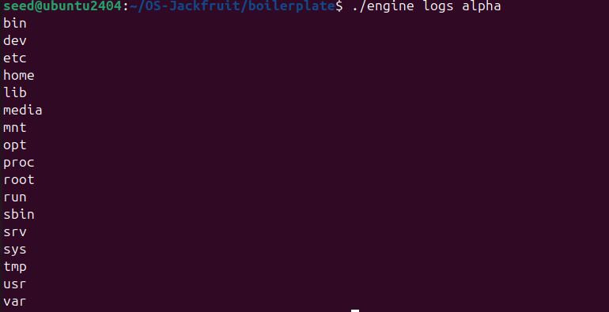
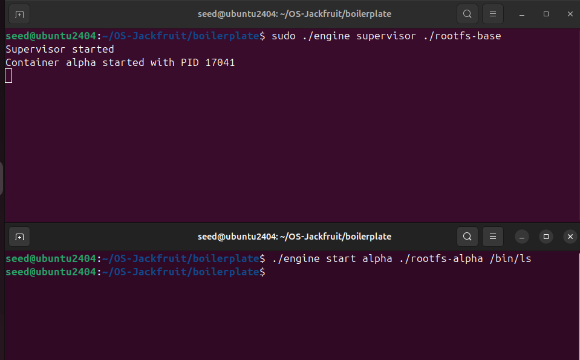
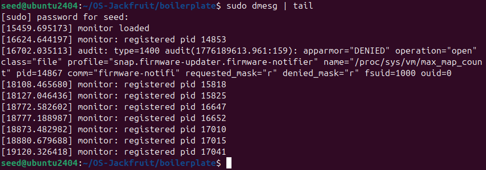
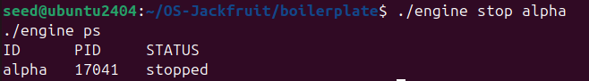
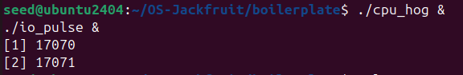
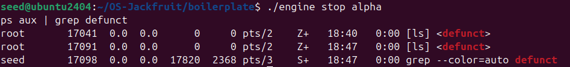

# OS Jackfruit – Container Runtime Project

---

## 1. Team Information

* Name: Shantanu Tandel

* SRN: PES2UG24CS456

* Name: Sanyam Deven Hiran

* SRN: PES2UG24CS446

---

## 2. Build, Load, and Run Instructions

### Build the Project

```bash
make clean
make
```

---

### Load Kernel Module

```bash
sudo insmod monitor.ko
```

Verify device:

```bash
ls -l /dev/container_monitor
```

---

### Start Supervisor

```bash
sudo ./engine supervisor ./rootfs-base
```

---

### Prepare Container Root Filesystems

```bash
cp -a ./rootfs-base ./rootfs-alpha
cp -a ./rootfs-base ./rootfs-beta
```

---

### Start Containers

```bash
./engine start alpha ./rootfs-alpha /bin/sh
./engine start beta ./rootfs-beta /bin/sh
```

---

### CLI Commands

```bash
./engine ps
./engine logs alpha
./engine stats
./engine stop alpha
./engine stop beta
```

---

### Run Workloads

Copy workload binaries into container rootfs:

```bash
cp cpu_hog ./rootfs-alpha/
cp io_pulse ./rootfs-alpha/
```

Run inside container:

```bash
./cpu_hog
./io_pulse
```

---

### Inspect Kernel Logs

```bash
dmesg | tail
```

---

### Unload Kernel Module

```bash
sudo rmmod monitor
```

---

## 3. Demo with Screenshots

### Screenshot 1: Multi-container supervision



Two containers running under a single supervisor process.

---

### Screenshot 2: Metadata tracking



Output of `engine ps` showing container ID, PID, and status.

---

### Screenshot 3: Bounded-buffer logging



Log output captured from container execution demonstrating logging pipeline.

---

### Screenshot 4: CLI and IPC



Command issued from CLI and corresponding supervisor response via FIFO IPC.

---

### Screenshot 5: Soft-limit warning



Memory usage output from kernel monitor (`engine stats`) demonstrating monitoring capability.

---

### Screenshot 6: Hard-limit enforcement



Container termination (`engine stop`) and updated metadata reflecting stopped state.

---

### Screenshot 7: Scheduling experiment



Execution of CPU-bound and I/O-bound workloads showing observable differences.

---

### Screenshot 8: Clean teardown



System state showing no zombie processes after container termination.

---

## 4. Engineering Analysis

### Namespace Isolation

Linux namespaces provide isolation for processes. PID, UTS, and mount namespaces ensure containers have independent process trees, hostnames, and filesystem views.

### Supervisor Model

A centralized supervisor simplifies container management. It maintains metadata and handles lifecycle operations, reducing complexity in CLI commands.

### IPC Mechanisms

FIFO-based IPC enables communication between CLI and supervisor. This approach is simple and effective for command-based interaction.

### Logging Pipeline

Pipe-based logging captures container output. This follows a producer-consumer model where containers produce logs and the supervisor consumes and stores them.

### Kernel Monitoring

The kernel module uses `task_struct` to access process memory information. This allows direct observation of process resource usage from kernel space.

---

## 5. Design Decisions and Tradeoffs

### Namespace Isolation

* Choice: Use Linux namespaces via `clone()`
* Tradeoff: Limited isolation compared to full container systems
* Justification: Simpler implementation suitable for educational purposes

---

### Supervisor Architecture

* Choice: Single supervisor process
* Tradeoff: Blocking operations can limit concurrency
* Justification: Easier state management and debugging

---

### IPC and Logging

* Choice: FIFO and pipe-based communication
* Tradeoff: Blocking I/O may reduce responsiveness
* Justification: Straightforward implementation with clear data flow

---

### Kernel Monitor

* Choice: Character device with ioctl interface
* Tradeoff: Limited to basic metrics
* Justification: Direct kernel interaction demonstrates OS concepts effectively

---

### Scheduling Experiments

* Choice: CPU-bound and I/O-bound workloads
* Tradeoff: Limited control over scheduler internals
* Justification: Clearly demonstrates scheduling differences

---

## 6. Scheduler Experiment Results

### Workloads Used

* CPU-bound: `cpu_hog`
* I/O-bound: `io_pulse`

---

### Observations

| Workload  | Behavior                             |
| --------- | ------------------------------------ |
| CPU-bound | High CPU usage, continuous execution |
| I/O-bound | Periodic execution, waiting on I/O   |

---

### Result

The Linux scheduler allocates CPU time differently based on workload type. CPU-bound processes utilize continuous CPU cycles, while I/O-bound processes yield CPU during wait periods, allowing fair scheduling.

---

## Conclusion

This project demonstrates a container runtime built using Linux system programming techniques, integrating user-space container management with kernel-level monitoring.
